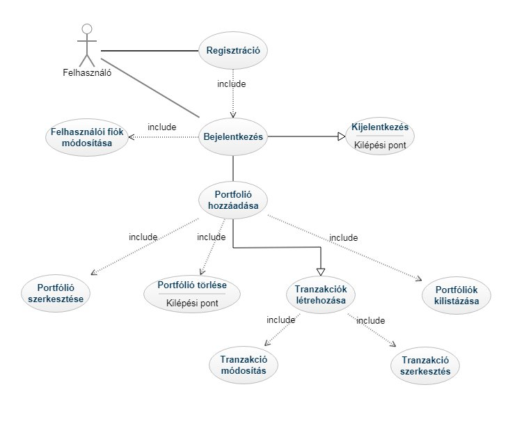

# Alkalmazások fejlesztése beadandó - Stocks

## 1. Követelményanalízis

### 1.1 Célkítűzés
Az alkalmazás lehetővé teszi a felhasználó számára, hogy portfóliója jelenlegi értékét követni tudja.
A program a megadott tranzakciókat azonos ticker alapján összegzi pozicíókba, majd ezekhez megjeleníti a jelenlegi piaci árat.
Felhasználó létrehozhat több portfóliót is, így tetszés szerint csoportosíthatja tranzakcióit. Portfóliók megoszthatóak a többi felhasználóval, de változtatni csak a tulajdonos tudja.

### 1.2 Funkcionális elvárások
 - Regisztráció
  - Bejelentkezés
    - Bejelentkezett felhasználó
      - Tulajdonos
        - Portfóliók listázása
          - Poziciók listázása
          - Tranzakciók listázása
         - Portfólió létrehozása, szerkesztése
         - Tranzakciók hozzáadása, szerkesztése, törlése
       - Megosztással rendelkezők
         - Poziciók listázása
           - Poziciók listázása 
           - Tranzakciók listázása
   
### 1.3 Nem funkcionális követelmények
  - Felhasználóbarát felület
  - Jelszóval védett funkciók
  - Űrlapok hibakezelése

### 1.4 Szakterületi fogalomjegyzék
  - portfólió: különféle értékpapírok összessége, amelyeket egy befektető egy adott időpontban birtokol
  - pozíció: azonos értékpapírok összessége
  - tranzakció: egy részvény eladása vagy vétele
  - ticker: egyedi azonosító részvényhez

### 1.5 Use-case modell

    
    
## 2. Tervezés

### 2.1 Oldaltérkép
  - Regisztráció
  - Bejelentkezés
    - Felhasználó saját portfóliók listája
      - Kiválasztott portfólióhoz tartozó poziciók listája
      - Kiválvaszott portfólióhoz tranzakció hozzáadása, szerkesztése űrlap
    - Felhasználóval megosztott portfóliók listája
      - Kiválasztott portfólióhoz tartozó poziciók listája
    
### 2.2 Végpontok
  - `GET `
    - `/portfolio`
      - `/get` portfólió lekérése
      - `/getOwnedPortfolios` felhasználó tulajdonában lévő portfóliók lekérése
    - `/position`
      - `/getPortfolioPositions` portfólióhoz tartozó poziciók lekérése
    - `/transaction`
      - `/getPortfolioTransactions` portfólióhoz tartozó tranzakciók lekérése
   - `POST`
     - `/portfolio`
       - `/add` új portfólió létrehozása
     - `/transaction`
       - `/add` új tranzakció hozzáadása
     - `/user`
       - `/register` regisztrálás
       - `/login` bejelentkezés 
   - `PUT`
     - `/portfolio`
       - `/update` portfólió változtatása (név)  
     - `/transaction`
       - `/update` tranzakció változtatása
       - `/updateMultiple` több tranzakció változtatása 
     - `/user`
       - `/update` felhasználó változtatása (felhasználónév, jelszó) 
 - `DELETE`
     - `/portfolio`
       - `/delete` portfólió törlése 
     - `/transaction`
       - `/delete˛` tranzakció törlése

### 2.3 Modellek

#### 2.3.1 Osztály modellek

	

#### 2.3.2 Adatbázis modellek

    
### 3. Implementáció

#### 3.1 Felhasznált eszközök, technológiák

  - Git - verziókezelő
  - Github - repository
  - IntelliJ IDEA - IDE
  - WebStorm - IDE
  - AngularJS - frontend framework
  - [**YahooFinance API**](https://github.com/sstrickx/yahoofinance-api) - piaci árak lekérésehez

### 3.2 YahooFinance API

Valósidejű piaci árak lekérésehez a YahooFinance API-t használtuk.
Ticker alapján létrehozható egy Stock objektum, a Stock objektumon pedig lekérhetőek a jelenlegi információk. (példa az API dokumentációjából)

	Stock stock = YahooFinance.get("INTC");
 
	BigDecimal price = stock.getQuote().getPrice();
	BigDecimal change = stock.getQuote().getChangeInPercent();
	BigDecimal peg = stock.getStats().getPeg();
	BigDecimal dividend = stock.getDividend().getAnnualYieldPercent();
 
	stock.print();
    
Output:

	INTC
	--------------------------------
	symbol: INTC
	name: Intel Corporation
	currency: USD
	stockExchange: NasdaqNM
	quote: Ask: 32.25, Bid: 32.24, Price: 32.2485, Prev close: 33.62
	stats: EPS: 2.019, PE: 16.65, PEG: 1.74
	dividend: Pay date: Mon Dec 01 06:00:00 CET 2014, Ex date: Tue Aug 05 06:00:00 CEST 2014, Annual yield: 2.68%
	history: null
	--------------------------------

Részletes leírás az API-ról: https://financequotes-api.com/ 

### 3.3 Könvytárstruktúra

#### 3.3.1 Backend

- controller
  - FinanceApiController
  - PortfolioController
  - PositionController
  - TransactionController
  - UserController
  
- exception
  - PortfolioDoesNotExistException
  - UserAlreadyExistException
  - WrongUserAndPasswordPairException

- model
  - Portfolio
  - Position
  - Transaction
  - TransactionType
  - User

- repository
  - PortfolioRepository
  - PositionRepository
  - TransactionRepository
  - UserRepository
 
 - service
   - FinanceApiService
   - PortfolioService
   - PositionService
   - TransactionService
   - UserService
 
 - wrapper
   - PortfolioDto
   - StockDto
   - WatchlistDto

#### 3.3.2 Frontend

- app
  - _constants
  - _guards
  - _models
  - _services
  - home
  - login
  - register
  
## 4. Tesztelés

	tests i guess

## 5. Fehasználói dokumentáció

	user documentation i guess
